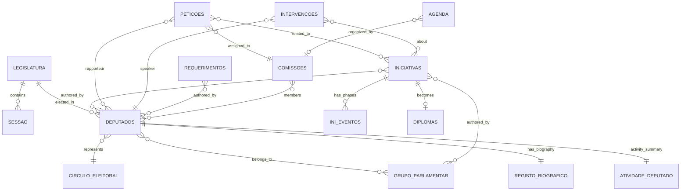

# Parliament Open Data: Entity Relationships

> Concise reference of all data sources from parlamento.pt and their relationships.

---

## Entities Overview

| Entity | File | Count | Primary Key | Description |
|--------|------|-------|-------------|-------------|
| **Deputados** | InformacaoBase | 1,446 | `DepId`, `DepCadId` | Members of Parliament |
| **GruposParlamentares** | InformacaoBase | 10 | `gpId` | Political parties/groups |
| **CirculosEleitorais** | InformacaoBase | 22 | `cpId` | Electoral constituencies |
| **Iniciativas** | Iniciativas | 808 | `IniId` | Legislative initiatives |
| **Petições** | Peticoes | 85 | `PetId` | Citizen petitions |
| **Intervenções** | Intervencoes | 2,133 | `Id` | Plenary speeches |
| **Requerimentos** | Requerimentos | 1,072 | `Id` | Written questions/requests |
| **Diplomas** | Diplomas | 236 | `Id` | Published laws/resolutions |
| **Comissões** | OrgaoComposicao | ~16 | `idOrgao` | Parliamentary committees |
| **Agenda** | AgendaParlamentar | 34 | `Id` | Calendar events |
| **RegistoBiográfico** | RegistoBiografico | 330 | `CadId` | Deputy biographies |
| **AtividadeDeputado** | AtividadeDeputado | 1,446 | `DepCadId` | Deputy activity summary |

---

## Key Relationships

### Direct Links (Foreign Keys Exist)

| From | To | Via | Cardinality |
|------|-----|-----|-------------|
| Deputados | GruposParlamentares | `DepGP.gpId` | N:1 |
| Deputados | CirculosEleitorais | `DepCPId` | N:1 |
| Iniciativas | GruposParlamentares | `IniAutorGruposParlamentares.GP` | N:N |
| Iniciativas | Deputados | `IniAutorDeputados.depId` | N:N |
| Intervenções | Deputados | `Deputados.idCadastro` | N:1 |
| Intervenções | Iniciativas | `Iniciativas.id` | N:N |
| Requerimentos | Deputados | `Autores.idCadastro` | N:N |
| Petições | Comissões | `DadosComissao.IdComissao` | N:1 |
| Petições | Deputados | `Relatores.id` | N:N |
| Diplomas | Iniciativas | `Iniciativas.IniId` | 1:N |
| Comissões | Deputados | `HistoricoComposicao.depId` | N:N |
| AtividadeDeputado | Deputados | `Deputado.DepCadId` | 1:1 |
| AtividadeDeputado | Iniciativas | `Ini.IniId` | 1:N |
| AtividadeDeputado | Requerimentos | `Req.ReqId` | 1:N |
| AtividadeDeputado | Intervenções | `Intev.IntId` | 1:N |
| RegistoBiográfico | Deputados | `CadId` = `DepCadId` | 1:1 |

### Indirect/Weak Links

| From | To | Via | Notes |
|------|-----|-----|-------|
| Iniciativas | Petições | `Peticoes` field | Often null |
| Iniciativas | Iniciativas | `IniciativasOrigem` | Parent initiatives |
| Petições | Iniciativas | `IniciativasConjuntas` | Often null |
| Agenda | Comissões | `OrgDes` (name match) | No direct ID link |

### Missing Links (Gaps)

| Expected Link | Status | Impact |
|---------------|--------|--------|
| Agenda → Iniciativas | ❌ Missing | Can't see which initiatives are discussed when |
| Iniciativas → Individual Votes | ❌ Missing | Can't track how each deputy voted |
| Intervenções → Votação | ❌ Missing | Can't link speeches to voting behavior |
| Deputados → Attendance | ❌ Missing | No attendance data |

---

## Entity Details

### Deputados (Deputies)
```
DepId: number           # Internal ID
DepCadId: number        # Cadastre ID (links to biography)
DepNomeParlamentar: string
DepNomeCompleto: string
DepCPId: number         # Constituency FK
DepGP: [{gpId, gpSigla, gpDtInicio, gpDtFim}]
DepSituacao: [{sioDes, sioDtInicio, sioDtFim}]  # "Efetivo", "Suspenso"
```

### Iniciativas (Legislative Initiatives)
```
IniId: string           # Primary key
IniNr: string           # Number (e.g., "28")
IniTipo: string         # J, R, P, D, I, S, A
IniDescTipo: string     # Full type name
IniTitulo: string
IniAutorDeputados: [{depId, nome}]
IniAutorGruposParlamentares: [{GP}]
IniAutorOutros: {nome}  # "Governo"
IniEventos: [{Fase, DataFase, Votacao, ...}]  # Lifecycle
IniLinkTexto: string    # PDF URL
```

### Intervenções (Speeches)
```
Id: string              # Primary key
Deputados: {idCadastro, nome, GP}
Iniciativas: [{id, tipo, fase}]
TipoIntervencao: string # "Interpelação", "Declaração"
Resumo: string
DadosAudiovisual: [{url, duracao}]  # Video links
DataReuniaoPlenaria: string
```

### Diplomas (Published Laws)
```
Id: string              # Primary key
Tipo: string            # "Lei", "Resolução da AR"
Titulo: string
Numero: string          # Law number
Iniciativas: [{IniId, IniNr, IniTipo}]  # Source initiatives
Publicacao: [{URLDiario, pubdt}]  # Official publication
```

---

## Relationship Diagram



---

## Data Flow: Initiative Lifecycle

```
┌─────────────┐    ┌─────────────┐    ┌─────────────┐
│  DEPUTADOS  │───▶│ INICIATIVAS │───▶│  DIPLOMAS   │
│  or GOVERNO │    │             │    │ (Lei/Res.)  │
└─────────────┘    └──────┬──────┘    └─────────────┘
                         │
                         ▼
              ┌─────────────────────┐
              │    INI_EVENTOS      │
              │ (60 phase types)    │
              │                     │
              │ Entrada → Admissão  │
              │ → Votação → ...     │
              │ → Publicação        │
              └─────────────────────┘
                         │
                         ▼
              ┌─────────────────────┐
              │   INTERVENCOES      │
              │  (plenary debates)  │
              └─────────────────────┘
```

---

## Data Quality Notes

| Entity | Issue | Impact |
|--------|-------|--------|
| Iniciativas.Votacao | Often null | Can't see vote results |
| Peticoes.IniciativasConjuntas | Usually null | Weak petition-initiative link |
| Agenda | No initiative IDs | Can't link schedule to legislation |
| RegistoBiografico | Many null fields | Incomplete deputy profiles |
| AtividadeDeputado | Nested structure | Complex to query |

---

## ID Cross-Reference

| Context | Deputy ID Field | Notes |
|---------|-----------------|-------|
| InformacaoBase | `DepId`, `DepCadId` | Primary records |
| Iniciativas | `IniAutorDeputados.depId` | Author link |
| Intervencoes | `Deputados.idCadastro` | Uses CadId |
| Requerimentos | `Autores.idCadastro` | Uses CadId |
| Peticoes | `Relatores.id` | Uses CadId |
| OrgaoComposicao | `depId`, `depCadId` | Both available |
| AtividadeDeputado | `Deputado.DepCadId` | Uses CadId |

**Key insight:** `DepCadId` is the universal deputy identifier across datasets.

---

## Unused/Low-Value Datasets

| Dataset | Records | Notes |
|---------|---------|-------|
| DelegacaoEventual | - | Occasional delegations |
| DelegacaoPermanente | - | Permanent delegations |
| GrupoDeAmizade | - | Friendship groups |
| ReunioesVisitas | - | Building visits |
| OE2026Or | - | Budget amendments |
| AtividadesXVII | - | Duplicates other data |

---

## Recommended Join Strategy

```sql
-- Deputy with all their initiatives
SELECT d.DepNomeParlamentar, i.IniTitulo, i.IniTipo
FROM Deputados d
JOIN Iniciativas i ON i.IniAutorDeputados CONTAINS d.DepCadId

-- Initiative with debates
SELECT i.IniTitulo, int.Resumo, int.DataReuniaoPlenaria
FROM Iniciativas i
JOIN Intervencoes int ON int.Iniciativas CONTAINS i.IniId

-- Laws from initiatives
SELECT d.Titulo AS Lei, i.IniTitulo AS Origem
FROM Diplomas d
JOIN d.Iniciativas ini ON ini.IniId = i.IniId
```

---

*Document generated from schema analysis of parlamento.pt open data portal.*
